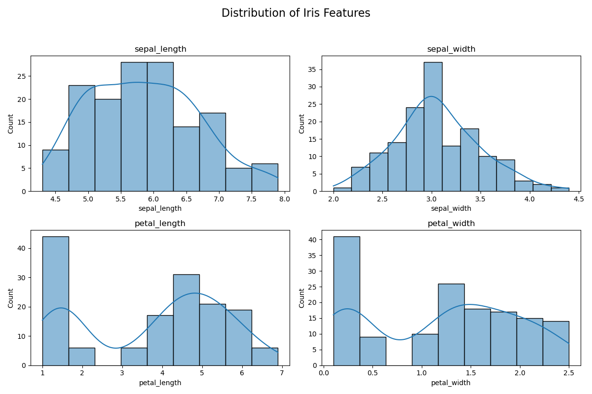
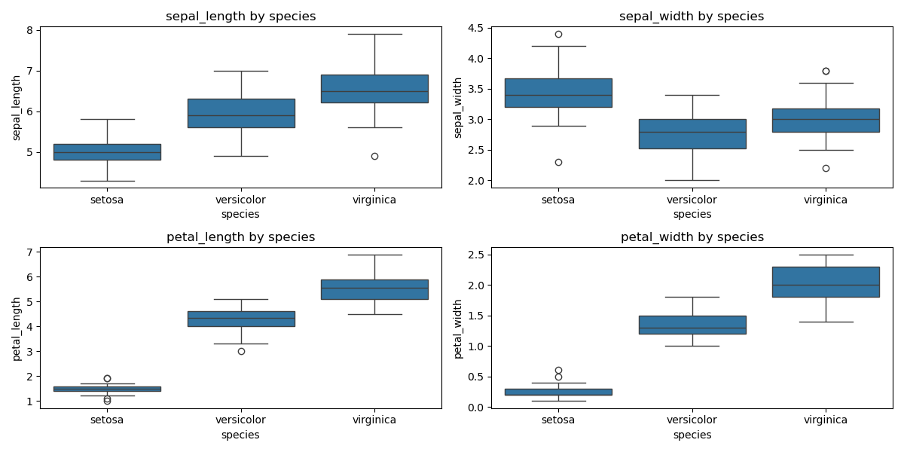
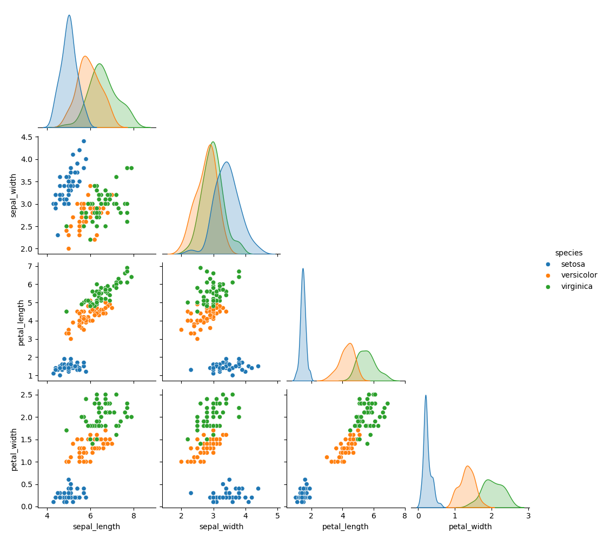

# 🌸 Iris Species Classifier

This project is a complete machine learning pipeline to classify iris flowers into three species  (**Setosa**, **Versicolor**, and **Virginica**) based on their sepal and petal measurements.

It started as a simple logistic regression model and evolved into a full experiment-driven workflow exploring feature engineering, regularization, and cross-validation. The goal was not just accuracy, but building a project that's clean, interpretable, and reproducible.

---

## 📁 Project Structure

```
iris-classifier/
├── data/                    # (Optional for storing datasets)
├── notebooks/
│   └── iris_classification.ipynb  # EDA + experiments in one notebook
├── src/
│   ├── train.py             # Final model training script
│   └── utils.py             # Evaluation helper functions
├── requirements.txt         # Dependencies
└── README.md
```

---

## 📊 Dataset

- **Source**: Built-in Iris dataset from `scikit-learn`
- **Features**: Sepal length & width, petal length & width
- **Target classes**: Setosa, Versicolor, Virginica

---

## 🔍 Exploratory Data Analysis (EDA)

To understand the relationships between features and target species, we explored:

- **Distribution plots**: For sepal and petal dimensions
- **Boxplots**: To analyze feature spread and outliers by class
- **Pairplot**: To visually assess how well-separated the classes are

---

## 📷 Visualizations

### Feature Distributions


### Boxplots by Species


### Pairplot


### Confusion Matrix (Final Model)


---

## 📊 Model Comparison Summary

| Experiment                        | Accuracy | Notes                          |
|-----------------------------------|----------|--------------------------------|
| Baseline (All 4 features)         | 97%      | Strong linear separation       |
| Petal-only                        | 93%      | Slight drop, useful insight    |
| Drop petal_width (high correlation) | 97%   | No impact — less redundancy    |
| Polynomial Features (deg=2)       | 97%      | No gain, no overfitting        |
| Interaction Terms Only            | 97%      | Similar to poly features       |
| PCA (2 components)                | 90%      | Loss of separability           |
| Decision Tree                     | 93%      | Nonlinear model, not better    |
| L2 Logistic Regression (C=0.1)    | 87%      | Underfit due to high penalty   |
| ✅ Final Model (C=10)             | **97.33%** (CV) | Best overall performance |

---

## 🧠 Final Model

After all the experiments, the best-performing model was:

> **Logistic Regression with L2 Regularization (C=10)**  
> - 100% accuracy on the test set  
> - 97.33% mean accuracy with 5-fold cross-validation

It strikes the perfect balance of simplicity, interpretability, and performance.

---

## ⚙️ How to Run

Make sure you’re in a virtual environment:

```bash
# Install dependencies
pip install -r requirements.txt

# Train and evaluate the final model
python src/train.py
```

---

## ✅ What I Learned

This project was a deep dive into:
- Building and comparing ML models step by step
- The power (and limits) of feature engineering
- Why regularization matters
- How to structure projects for real-world use

---

## 🚀 What’s Next

- Add grid search for tuning
- Try out ensemble models like Random Forests
- Deploy as a simple Streamlit demo

---

## 👋 About Me

I'm **Srivatsa**, a master's student in Informatics with a focus on machine learning and reproducible data science. This project is part of my hands-on portfolio exploring real-world ML workflows.

Thanks for checking it out!
